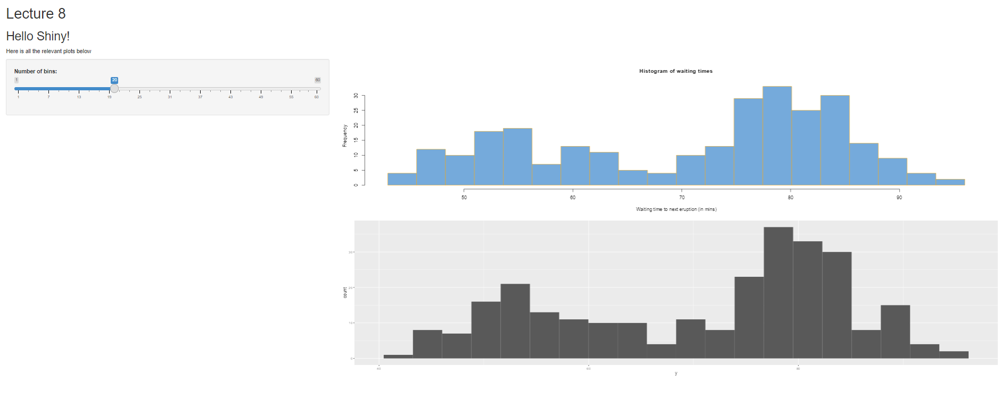

```{r setup, include=FALSE}
knitr::opts_chunk$set(echo = TRUE)
```

```{r, out.height= "550px",out.width="600px",echo=TRUE,fig.cap="Code Along 8"}

```


```{r, out.height= "550px",out.width="600px",echo=TRUE,fig.cap="Challenge 8"}
knitr::include_graphics("challenge_8.png")
```
1) Add heading h1 "Challenge 8"
2) Change the App title from "Shiny Text" to "Dataset for Rocks/Pressure/Cars" and bold them using strong()
3) Change the Number of observations to 100 
4) Add 3 images (rock, pressure gauge and car)
5) Add captions below the images and label them with different colours


